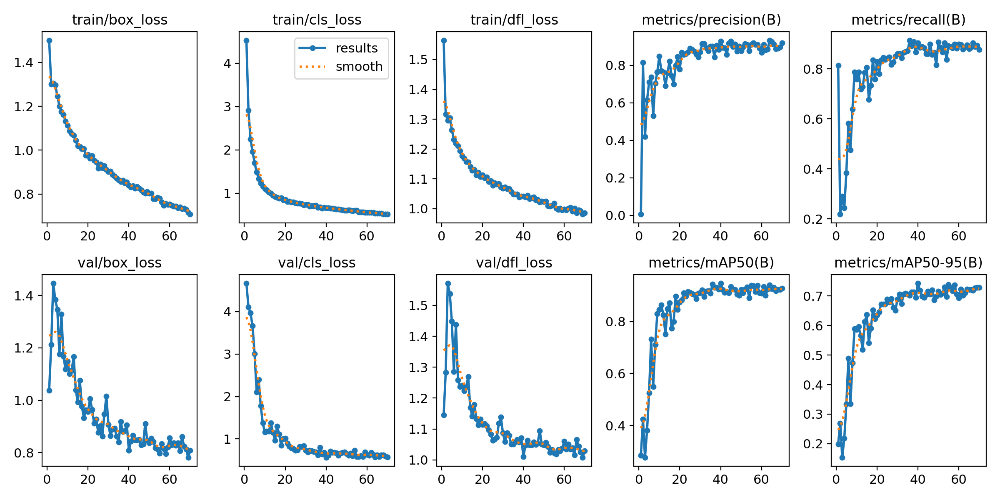
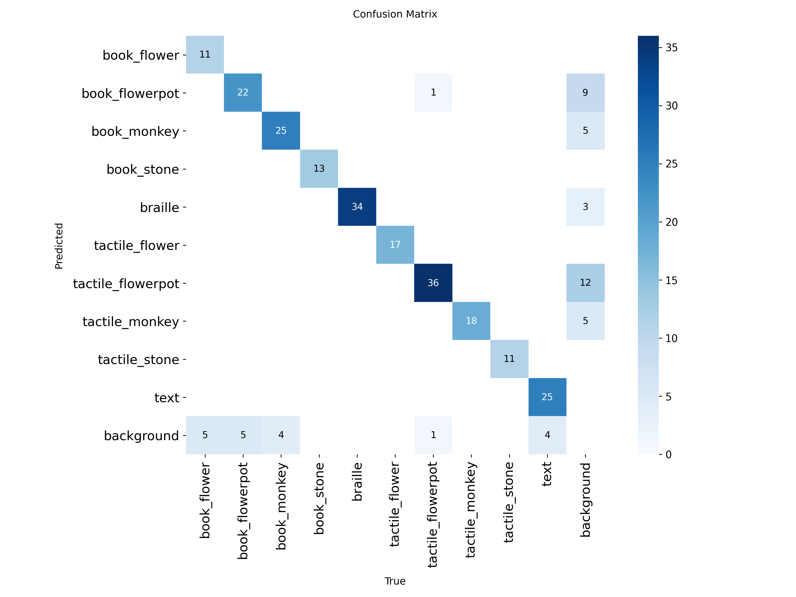

# Fingertips AI-Data

촉각형 그림책 기반 객체 인식 프로젝트의 데이터셋 관리 및 AI 추론 산출물 레포지토리입니다.

본 레포지토리는 촉각형 그림책 이미지 데이터셋, 페이지 분류 데이터셋, YOLO11 객체 탐지 모델, 페이지 분류 모델, 손끝 추출 모델, 백엔드 연동용 추론 서버를 관리합니다.

## System Overview

시각장애 아동이 촉각형 그림책을 손끝으로 가리키면 AI가 페이지와 객체를 인식하고 해당 설명을 음성으로 안내하는 시스템입니다.

페이지별로 제공되는 설명 내용이 다르기 때문에, 먼저 현재 페이지를 분류한 뒤 객체 탐지 결과와 결합하여 사용자에게 적절한 설명을 제공합니다.

### Pipeline

1. **Input**
   - 카메라로 그림책과 손 입력

2. **Vision Perception**
   - MobileNetV2 기반 페이지 분류
   - YOLO11 기반 객체 탐지
   - MediaPipe 기반 손끝 좌표 추출

3. **Interaction**
   - 손끝 좌표와 객체 위치 매칭
   - 사용자가 가리키는 객체 선택

4. **Content Retrieval**
   - 페이지 + 객체 조합으로 설명 조회
   - 이미지, 점자, 텍스트 정보 제공

5. **Output**
   - TTS를 통해 음성 안내 제공


## Tech Stack

| Area                    | Stack                   |
| ----------------------- | ----------------------- |
| Object Detection        | YOLO11n, Ultralytics    |
| Page Classification     | MobileNetV2, TensorFlow |
| Hand Landmark Detection | MediaPipe               |
| Dataset Management      | Roboflow                |
| Inference Server        | FastAPI, Uvicorn        |
| Model Experiment        | Google Colab, PyTorch   |

## Repository Structure

- `docs` : 데이터셋 구조 및 클래스 정의 문서
- `dataset` : 학습 데이터셋
- `notebooks` : 모델 학습 및 실험 노트북
- `artifacts` : 학습된 모델 및 백엔드 전달용 산출물
- `scripts` : 웹캠 테스트 실행 스크립트
- `server` : 백엔드 연동용 Predict API 서버

## Datasets

본 프로젝트는 Roboflow를 통해 객체 탐지(Object Detection) 데이터셋과 페이지 분류(Image Classification) 데이터셋을 별도로 관리합니다.

### Object Detection Dataset

- Dataset: https://universe.roboflow.com/2026-oss/ai-picture-book-object-detection
- Task: Object Detection
- Model: YOLO11

#### Classes

| Class               | Description                  |
| ------------------- | ---------------------------- |
| `book_flower`       | 그림책 페이지 내 꽃 그림     |
| `book_flowerpot`    | 그림책 페이지 내 화분 그림   |
| `book_monkey`       | 그림책 페이지 내 원숭이 그림 |
| `book_stone`        | 그림책 페이지 내 돌 그림     |
| `braille`           | 점자 영역                    |
| `tactile_flower`    | 촉각 교구 꽃                 |
| `tactile_flowerpot` | 촉각 교구 화분               |
| `tactile_monkey`    | 촉각 교구 원숭이             |
| `tactile_stone`     | 촉각 교구 돌                 |
| `text`              | 일반 텍스트 영역             |

### Page Classification Dataset

- Dataset: https://universe.roboflow.com/2026-oss/ai-picture-book-page-detection
- Task: Image Classification
- Model: MobileNetV2

#### Classes

| Class   | Description                              |
| ------- | ---------------------------------------- |
| `page1` | 그림책 1페이지                           |
| `page2` | 그림책 2페이지                           |
| `page3` | 그림책 3페이지                           |
| `none`  | 책이 없거나 페이지를 판별할 수 없는 화면 |

## Page Content Guide

페이지 분류 결과와 객체 탐지 결과를 결합해 사용자에게 안내할 콘텐츠 기준입니다.

### Demonstration Video

| Page    | Video                        |
| ------- | ---------------------------- |
| `page1` | https://youtu.be/Alp6did2Irc |
| `page2` | https://youtu.be/xnNB3q-thUk |
| `page3` | https://youtu.be/gciueL3Cr3Q |

### Page Storyboard

| Page    | Book Objects            | Tactile Objects          | Text                                                                             |
| ------- | ----------------------- | ------------------------ | -------------------------------------------------------------------------------- |
| `page1` | 원숭이, 꽃, 돌          | 원숭이, 꽃, 돌           | 시들어가는 하얀 꽃 한 송이를 발견했어요. 길을 걷던 사람에게 밟혀 다친 것 같아요. |
| `page2` | 고릴라/원숭이, 화분인형 | 원숭이, 코코넛 화분      | 꼬마 원숭이는 코코넛을 주워 반으로 쪼갠 다음 그 안에 흙을 넣고 꽃을 심었어요.    |
| `page3` | 화분 인형, 원숭이       | 원숭이, 코코넛 질감 화분 | 여러 날이 지나갔습니다. 꽃은 싱싱하게 살아났어요.                                |

`page2`, `page3`의 화분 촉각 교구는 색종이를 붙여 코코넛의 오돌토돌한 질감을 표현합니다.

### Voice Response Mapping

페이지와 객체 라벨이 매칭되었을 때 TTS로 안내할 기본 문장입니다.

#### Common Messages

| Key                            | Message                                                                |
| ------------------------------ | ---------------------------------------------------------------------- |
| `default`                      | 음, 아직 잘 모르겠어. 손끝으로 다시 천천히 가리켜 줘.                  |
| `matched_description_fallback` | 찾았어. 책 페이지가 더 잘 보이게 다시 비춰 주면 자세히 말해 줄게.      |
| `camera_not_ready`             | 카메라가 아직 안 켜졌어. 카메라를 켜고 다시 해보자.                    |
| `no_finger`                    | 손끝이 잘 안 보여. 손을 화면 안에 넣고 다시 가리켜 줘.                 |
| `no_objects`                   | 책이랑 놀이도구가 잘 안 보여. 카메라 앞에 다시 놓아 줘.                |
| `not_target_area`              | 여기는 설명할 곳이 아닌 것 같아. 책이나 놀이도구를 손끝으로 가리켜 줘. |
| `matched`                      | 찾았어.                                                                |
| `closer`                       | 조금만 더 가까이 가리켜 줘.                                            |

#### Page 1

| Object Label     | Message                                                                              |
| ---------------- | ------------------------------------------------------------------------------------ |
| `book_monkey`    | 꼬마 원숭이가 있어.                                                                  |
| `book_flower`    | 하얀 꽃이 시들어가고 있어.                                                           |
| `book_stone`     | 돌이 있어. 돌 뒤에 꼬마 원숭이가 숨어 있어.                                          |
| `tactile_monkey` | 부들부들한 원숭이야. 손끝으로 천천히 만져봐.                                         |
| `tactile_flower` | 시들어가는 꽃이야. 꽃잎 모양을 손끝으로 만져봐.                                      |
| `tactile_stone`  | 동글동글한 돌멩이야. 손끝으로 천천히 만져봐.                                         |
| `braille`        | 점자야. 시들어가는 하얀 꽃 한 송이를 발견했어. 길을 걷던 사람에게 밟혀 다친 것 같아. |
| `text`           | 시들어가는 하얀 꽃 한 송이를 발견했어. 길을 걷던 사람에게 밟혀 다친 것 같아.         |

#### Page 2

| Object Label        | Message                                                                                     |
| ------------------- | ------------------------------------------------------------------------------------------- |
| `book_monkey`       | 꼬마 원숭이가 코코넛 화분에 꽃을 심고 있어.                                                 |
| `book_flowerpot`    | 코코넛 화분이야. 안에 흙을 담고 꽃을 심었어.                                                |
| `tactile_monkey`    | 부들부들한 원숭이야. 손끝으로 천천히 만져봐.                                                |
| `tactile_flowerpot` | 오돌토돌한 코코넛 화분이야. 울퉁불퉁한 곳을 손끝으로 만져봐.                                |
| `braille`           | 점자 라벨이야. 꼬마 원숭이는 코코넛을 주워 반으로 쪼갠 다음, 그 안에 흙을 넣고 꽃을 심었어. |
| `text`              | 꼬마 원숭이는 코코넛을 주워 반으로 쪼갠 다음, 그 안에 흙을 넣고 꽃을 심었어.                |

#### Page 3

| Object Label        | Message                                                      |
| ------------------- | ------------------------------------------------------------ |
| `book_monkey`       | 꼬마 원숭이가 싱싱해진 꽃 화분을 보고 있어.                  |
| `book_flower`       | 꽃이 다시 싱싱해졌어.                                        |
| `book_flowerpot`    | 꽃이 담긴 화분이야. 꼬마 원숭이가 잘 돌봐줬어.               |
| `tactile_monkey`    | 부들부들한 원숭이야. 손끝으로 원숭이 모양을 느껴봐.          |
| `tactile_flower`    | 싱싱해진 꽃이야. 꽃잎 모양을 손끝으로 만져봐.                |
| `tactile_flowerpot` | 오돌토돌한 코코넛 화분이야. 울퉁불퉁한 곳을 손끝으로 만져봐. |
| `braille`           | 점자 라벨이야. 여러 날이 지나갔어. 꽃은 싱싱하게 살아났어.   |
| `text`              | 여러 날이 지나갔어. 꽃은 싱싱하게 살아났어.                  |

## Documents

### Dataset Guides

- [01_dataset_structure.md](docs/01_dataset_structure.md): 페이지 분류 및 객체 탐지 데이터셋 구조, 클래스 정의, 분할 기준
- [02_dataset_collection.md](docs/02_dataset_collection.md): 객체 탐지 데이터셋 수집 대상, 촬영 조건, Roboflow 업로드 기준
- [03_dataset_labeling.md](docs/03_dataset_labeling.md): Bounding Box 라벨링 기준 및 페이지별 객체 음성 설명 매핑
- [04_dataset_preprocessing_augmentation.md](docs/04_dataset_preprocessing_augmentation.md): 데이터 전처리, 증강, split 검수 및 Roboflow Version 생성 기준
- [06_yolov5_training_environment.md](docs/06_yolov5_training_environment.md): Google Colab 기반 YOLOv5·YOLO11 학습 환경 구축 및 검증 가이드

### Model Reports

- [08_yolov5_yolo11_v6_model_comparison.md](docs/08_yolov5_yolo11_v6_model_comparison.md): YOLOv5s v6와 YOLO11n v6 성능 비교
- [35_yolo11n_v6_training_report.md](docs/35_yolo11n_v6_training_report.md): YOLO11n v6 학습 결과 리포트
- [45_yolov11_v11_training_report.md](docs/45_yolov11_v11_training_report.md): YOLO11n v11 학습 결과 리포트
- [55_yolo11n_v15_training_report.md](docs/55_yolo11n_v15_training_report.md): YOLO11n v15 학습 결과 리포트

성능 비교 원본 CSV는 [08_yolov5_yolo11_v6_model_comparison.csv](docs/08_yolov5_yolo11_v6_model_comparison.csv)에 정리되어 있습니다.

## Model Performance

현재 백엔드와 웹캠 테스트의 기본 객체 탐지 모델은 YOLO11n v15입니다.

### Model History

| Model   | Dataset      | Precision | Recall | mAP@0.5 | mAP@0.5:0.95 | Artifact                               |
| ------- | ------------ | --------: | -----: | ------: | -----------: | -------------------------------------- |
| YOLOv5s | Roboflow v2  |     0.847 |  0.889 |   0.898 |        0.641 | `artifacts/yolov5-v2/best.pt`          |
| YOLO11n | Roboflow v6  |     0.835 |  0.719 |   0.776 |        0.545 | `models/yolo11n_v6_best.pt`            |
| YOLO11n | Roboflow v11 |     0.903 |  0.857 |   0.919 |        0.708 | `artifacts/yolo11-v11/best.pt`         |
| YOLO11n | Roboflow v15 |     0.936 |  0.842 |   0.896 |        0.689 | `artifacts/yolo11-v15/weights/best.pt` |

v15 모델은 Precision이 높아 오탐 억제에 강점이 있지만, v11 대비 Recall과 bbox 정밀도 지표는 낮게 나타났습니다. 최종 적용 여부는 실제 웹캠 입력에서 손끝 선택 품질을 함께 확인해야 합니다.

### YOLO11n v15 Object Detection

Roboflow v15 데이터셋 기준으로 YOLO11n 모델을 학습했습니다. 상세 내용은 [55_yolo11n_v15_training_report.md](docs/55_yolo11n_v15_training_report.md)에 정리되어 있습니다.

#### Test Set Performance

| Metric       | Score |
| ------------ | ----: |
| Precision    | 0.936 |
| Recall       | 0.842 |
| mAP@0.5      | 0.896 |
| mAP@0.5:0.95 | 0.689 |

#### Validation Set Performance

| Metric       | Score |
| ------------ | ----: |
| Images       |   247 |
| Instances    |   232 |
| Precision    | 0.929 |
| Recall       | 0.904 |
| mAP@0.5      | 0.947 |
| mAP@0.5:0.95 | 0.743 |

#### Class-wise Test Performance

| Class               | Precision | Recall | mAP@0.5 | mAP@0.5:0.95 |
| ------------------- | --------: | -----: | ------: | -----------: |
| `book_flower`       |     0.967 |  0.714 |   0.897 |        0.506 |
| `book_flowerpot`    |     0.860 |  0.867 |   0.894 |        0.626 |
| `book_monkey`       |     0.870 |  0.750 |   0.881 |        0.685 |
| `book_stone`        |     1.000 |  0.729 |   0.835 |        0.725 |
| `braille`           |     0.838 |  0.974 |   0.838 |        0.708 |
| `tactile_flower`    |     0.985 |  1.000 |   0.995 |        0.796 |
| `tactile_flowerpot` |     0.871 |  0.797 |   0.914 |        0.713 |
| `tactile_monkey`    |     1.000 |  0.776 |   0.827 |        0.668 |
| `tactile_stone`     |     0.976 |  1.000 |   0.995 |        0.805 |
| `text`              |     0.990 |  0.815 |   0.885 |        0.660 |

`book_flower`, `book_monkey`, `book_stone`은 Recall이 상대적으로 낮아 실제 웹캠 환경에서 미탐 사례를 우선 확인해야 합니다. 손끝 좌표와 bbox를 매칭하는 구조이므로 단순 탐지 성능뿐 아니라 bbox 정밀도와 손끝 선택 정확도도 함께 검증합니다.

#### Training Results

<p align="center">
  
</p>

<p align="center">
  
</p>

### MobileNetV2 Page Classification

`artifacts/page-classifier-mobilenetv2/page_classifier_mobilenetv2.keras` 모델은 Roboflow 페이지 분류 데이터셋 기반으로 학습한 페이지 분류 모델입니다.

제공된 40장 테스트 split 기준으로 모든 클래스가 정분류되었으며, 상세 산출물은 `artifacts/page-classifier-mobilenetv2`에 포함되어 있습니다.

#### Test Set Performance

| Metric      | Score |
| ----------- | ----: |
| Accuracy    | 1.000 |
| Macro F1    | 1.000 |
| Weighted F1 | 1.000 |
| Test Images |    40 |

#### Class-wise Test Performance

| Class   | Precision | Recall | F1-score | Support |
| ------- | --------: | -----: | -------: | ------: |
| `none`  |     1.000 |  1.000 |    1.000 |      13 |
| `page1` |     1.000 |  1.000 |    1.000 |       8 |
| `page2` |     1.000 |  1.000 |    1.000 |      12 |
| `page3` |     1.000 |  1.000 |    1.000 |       7 |

#### Confusion Matrix

| Actual \ Predicted | `none` | `page1` | `page2` | `page3` |
| ------------------ | -----: | ------: | ------: | ------: |
| `none`             |     13 |       0 |       0 |       0 |
| `page1`            |      0 |       8 |       0 |       0 |
| `page2`            |      0 |       0 |      12 |       0 |
| `page3`            |      0 |       0 |       0 |       7 |

학습 history의 마지막 epoch 기준 validation accuracy는 0.988, validation loss는 0.033입니다. 실제 웹캠 입력에서는 조명, 각도, 손 가림에 따라 분류가 흔들릴 수 있어 EMA smoothing, confidence threshold, top1-top2 margin, stable frame 조건을 함께 적용합니다.

## Webcam Page Classifier

`artifacts/page-classifier-mobilenetv2/page_classifier_mobilenetv2.keras` 모델로 웹캠 페이지 분류를 실행할 수 있습니다.

```bash
cd AI-Data
bash scripts/run_page_classifier_webcam.sh
```

기본 클래스 순서는 훈련 노트북 기준 `none,page1,page2,page3`입니다.

다른 모델이나 카메라를 사용할 경우 환경변수로 변경할 수 있습니다.

```bash
MODEL_PATH=artifacts/page-classifier-mobilenetv2/page_classifier_mobilenetv2.keras \
SOURCE=1 \
bash scripts/run_page_classifier_webcam.sh
```

웹캠 페이지 분류는 최근 프레임 EMA smoothing, `top1 - top2` margin 검사, 연속 reliable frame 확인을 함께 사용합니다.

페이지가 자주 튀면 `SMOOTHING_ALPHA`를 낮추거나 `STABLE_FRAMES`를 올립니다.

애매한 화면에서 label이 너무 쉽게 뜨면 `MARGIN_THRESHOLD`, `THRESHOLD`, `NONE_THRESHOLD`를 올립니다.

```bash
THRESHOLD=0.65 \
MARGIN_THRESHOLD=0.20 \
SMOOTHING_ALPHA=0.25 \
STABLE_FRAMES=3 \
bash scripts/run_page_classifier_webcam.sh
```

산출물에 포함된 class names JSON을 명시해서 실행할 수도 있습니다.

```bash
LABELS_FILE=artifacts/page-classifier-mobilenetv2/page_classifier_class_names.json \
bash scripts/run_page_classifier_webcam.sh
```

## Webcam YOLO11 Object Detector

`artifacts/yolo11-v15/weights/best.pt` 모델로 웹캠 객체 탐지를 실행할 수 있습니다.

```bash
cd AI-Data
bash scripts/run_yolo11_webcam.sh
```

기본 카메라는 `SOURCE=0`입니다.

다른 카메라나 iPhone Continuity Camera를 사용하는 경우 `SOURCE=1`처럼 변경하여 실행합니다.

```bash
SOURCE=1 bash scripts/run_yolo11_webcam.sh
```

손끝으로 객체를 가리키고 일정 시간 유지하여 선택하는 모드는 다음과 같이 실행합니다.

```bash
HAND_MODE=point bash scripts/run_yolo11_webcam.sh
```

이 모드에서는 손끝이 가장 많이 가리킨 객체 하나만 화면에 표시됩니다.

손끝 판정 범위가 너무 좁거나 넓으면 `POINT_MARGIN` 값을 조절합니다.

```bash
SOURCE=1 \
HAND_MODE=point \
POINT_MARGIN=60 \
bash scripts/run_yolo11_webcam.sh
```

객체가 잘 검출되지 않으면 confidence를 낮추거나 입력 크기를 키워 작은 객체 감도를 높일 수 있습니다.

기본값은 다음과 같습니다.

- `CONF=0.15`
- `IMG_SIZE=960`
- `POINT_MARGIN=50`

```bash
SOURCE=1 \
CONF=0.10 \
IMG_SIZE=960 \
POINT_MARGIN=60 \
bash scripts/run_yolo11_webcam.sh
```

## Predict API Server

백엔드 연동용 추론 서버는 기본적으로 현재 안정 버전 모델을 사용합니다.

### Default Models

- YOLO 모델: `artifacts/yolo11-v15/weights/best.pt`
- YOLO 클래스 정보: `artifacts/yolo11-v15/configs/data.yaml`
- 페이지 분류 모델: `artifacts/page-classifier-mobilenetv2/page_classifier_mobilenetv2.keras`
- 손끝 추출 모델: `artifacts/hand-landmarker/hand_landmarker.task`

### Run Server

```bash
python3 -m uvicorn server.main:app --host 127.0.0.1 --port 8001
```

기본 모델 경로는 프로젝트 루트 기준으로 해석됩니다.

환경변수로 상대경로를 지정할 때도 `AI-Data` 루트 기준 경로를 사용합니다.

### Predict Response

`/predict`는 다음 정보를 반환합니다.

- 페이지 분류 결과
- YOLO 객체 검출 결과 전체
- 손끝 좌표
- 페이지 예측 신뢰도 정보

손끝-객체 매칭은 백엔드 `/api/interaction/detect`에서 처리합니다.

### Environment Variables

| Variable                         | Default | Description                               |
| -------------------------------- | ------- | ----------------------------------------- |
| `YOLO_CONF`                      | `0.15`  | YOLO confidence threshold                 |
| `YOLO_IMGSZ`                     | `960`   | YOLO inference image size                 |
| `HAND_MIN_DETECTION_CONFIDENCE`  | `0.4`   | Hand detection confidence                 |
| `HAND_MIN_PRESENCE_CONFIDENCE`   | `0.4`   | Hand presence confidence                  |
| `HAND_MIN_TRACKING_CONFIDENCE`   | `0.4`   | Hand tracking confidence                  |
| `FINGER_SMOOTHING_ALPHA`         | `0.55`  | Finger coordinate EMA smoothing ratio     |
| `FINGER_MISSING_GRACE_FRAMES`    | `2`     | Frames to preserve last finger position   |
| `PAGE_CONFIDENCE_THRESHOLD`      | `0.75`  | Minimum page confidence threshold         |
| `PAGE_MARGIN_THRESHOLD`          | `0.15`  | Minimum top1-top2 margin                  |
| `PAGE_SMOOTHING_ALPHA`           | `0.35`  | Page prediction EMA smoothing ratio       |
| `PAGE_STABLE_FRAMES`             | `2`     | Minimum stable frames before confirmation |
| `PAGE_NONE_CONFIDENCE_THRESHOLD` | `0.90`  | Confidence threshold for `none` class     |
| `PAGE_CLASSES_FILE`              | -       | Class names JSON/text file path           |

오탐이 증가하면 `YOLO_CONF=0.20~0.25`를 시도합니다.

작은 객체를 더 잘 검출해야 한다면 `YOLO_CONF=0.10` 또는 `YOLO_IMGSZ=1280`을 사용할 수 있습니다.

페이지 예측이 불안정한 경우 `/predict` 응답의 `page`에 다음 정보가 함께 포함됩니다.

- `top_k`
- `margin`
- `raw`
- `smoothed`
- `reliable`

`reliable=false`인 경우 마지막으로 확정된 label을 유지하면서 confidence를 낮춰 백엔드 fallback이 동작하도록 합니다.

## Change Model Paths

YOLO 모델 버전이 변경되면 코드 수정 없이 실행 시 경로만 변경하면 됩니다.

```bash
YOLO_MODEL_PATH=artifacts/yolo11-v15/weights/best.pt \
YOLO_DATA_YAML=artifacts/yolo11-v15/configs/data.yaml \
python3 -m uvicorn server.main:app --host 127.0.0.1 --port 8001
```

페이지 분류 모델이나 손끝 추출 모델도 동일한 방식으로 변경할 수 있습니다.

```bash
PAGE_MODEL_PATH=artifacts/page-classifier-mobilenetv2/page_classifier_mobilenetv2.keras \
HAND_LANDMARKER_MODEL_PATH=artifacts/hand-landmarker/hand_landmarker.task \
python3 -m uvicorn server.main:app --host 127.0.0.1 --port 8001
```

## License

본 프로젝트는 MIT License를 따릅니다. 자세한 내용은 [LICENSE](LICENSE)를 참고하세요.

## Notes

- 최종 모델 판단 시 test set 성능뿐 아니라 실제 웹캠 환경에서의 손끝 선택 정확도를 함께 확인해야 합니다.
- 조명, 각도, 손가락 가림, 페이지 기울어짐에 따라 실제 서비스 성능이 달라질 수 있습니다.
- 객체가 누락되는 경우 confidence threshold, image size, 손끝 판정 margin을 함께 조정합니다.
